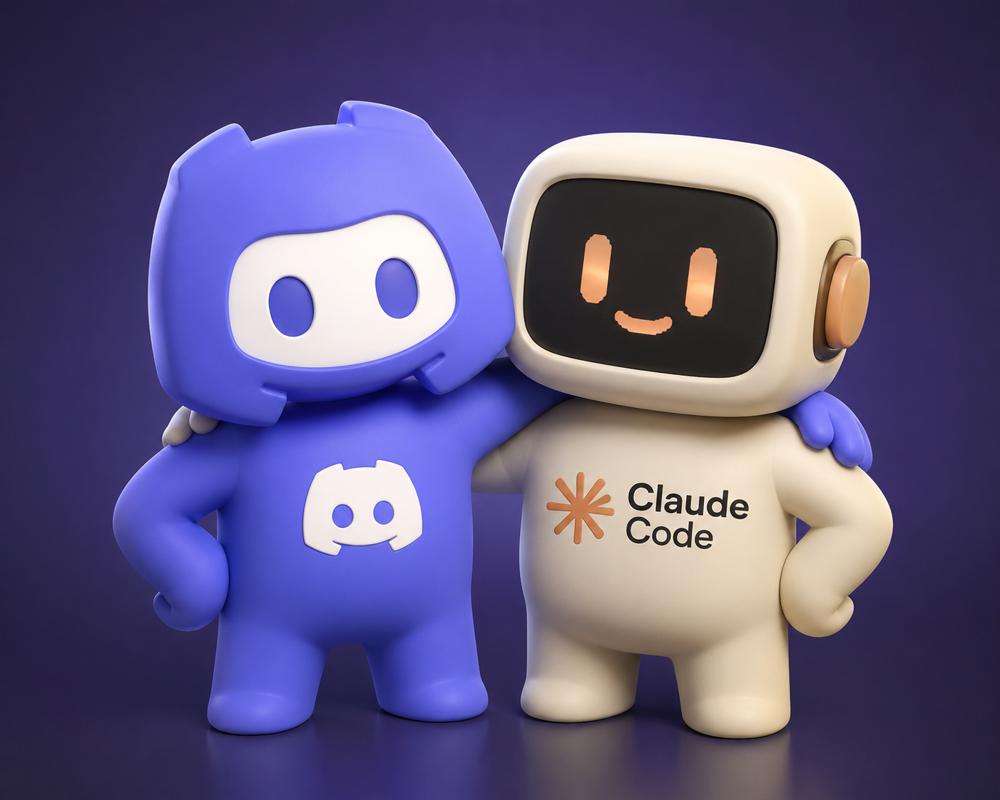
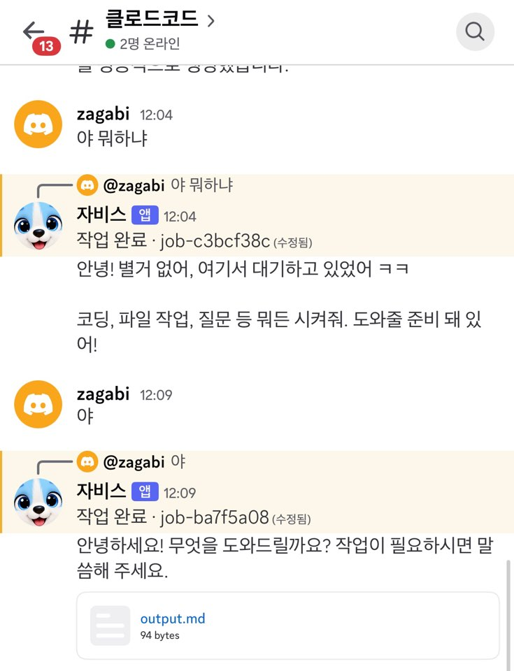

# 디스코드로 부르는 클로드코드, claudecord

[]() 

## 디스코드 앱으로 명령하는 모습


> **PC 앞을 떠나도 멈추지 않는 AI 비서**
> 모바일에서 Discord 메시지 한 통이면, 집에 있는 내 PC의 Claude Code가 깨어나 일을 시작합니다.

[]()
[]()
[]()

---

## ✨ 이런 적 없으셨나요?

카페에서 커피를 마시다가 문득 떠오릅니다.

> *"어제 만들던 숏폼, 미세 조정만 좀 더 하면 되는데..."*

이때 선택지는 두 가지뿐입니다.

1. 노트북을 꺼내 터미널을 띄운다 → **30분 손실**
2. 메모만 하고 PC 앞에 돌아갈 때까지 미룬다 → **절반의 확률로 망각**

이미 집에는 24시간 깨어 있는 PC가 있고, Claude Code도 깔려 있습니다. **부족한 건 단 하나, 모바일에서 그 PC를 연결해서 명령어를 실행하는 비서, claudecord**입니다. 

---

## 🎯 주요 기능

- 📱 **모바일에서 PC 제어**: Discord 메시지로 Claude Code 작업 지시
- 🔒 **화이트리스트 인증**: 등록된 사용자 ID와 채널 ID에서만 동작
- 📦 **작업 격리**: 모든 작업은 `runs/job-xxxx/` 디렉터리에 분리 실행
- 📎 **결과물 자동 첨부**: CLI가 생성한 파일을 Discord로 즉시 전송
- 🛑 **원격 세션 종료**: Discord에서 `종료`를 보내 실행 중인 Claude Code 프로세스와 저장된 대화 세션을 한 번에 정리
- 💸 **추가 비용 0원**: Claude Pro/Max 구독 한도 안에서 동작, API 키 불필요

---

## 🏗️ 작동 방식

```
[모바일/PC Discord]
        │
        ▼ 메시지
[Discord Gateway]  ◄── outbound WebSocket ──┐
                                            │
                                    [내 PC의 claudecord 봇]
                                            │
                                            ▼ subprocess
                                    [Claude Code CLI]
                                            │
                                            ▼
                                    [runs/job-xxxx/]
                                    파일 생성/수정
                                            │
                                            ▼
                                    [Discord 채널에 결과 첨부]
```

봇은 **클라우드가 아닌 내 PC 안에서 돌아갑니다**. Discord Gateway는 봇 쪽에서 outbound WebSocket으로 연결하는 구조라, 별도 호스팅 없이 PC에서 직접 띄울 수 있습니다.

---

## 🚀 빠른 시작

### 사전 요구사항

- Python 3.10 이상
- Claude Code CLI 설치 및 로그인 완료
- Discord 계정

### 1. Discord 봇 만들기

1. [Discord Developer Portal](https://discord.com/developers/applications) 접속
2. **New Application** → 이름 입력 (예: `claudecord`)
3. 좌측 **Bot** 탭 → **Reset Token** → 토큰 복사 후 안전한 곳에 저장
4. **MESSAGE CONTENT INTENT** 토글 **ON**

### 2. 봇 권한 설정

**OAuth2 → URL Generator** 에서 다음을 체크:

**Scopes**
- `bot`
- `applications.commands`

**Bot Permissions**

| 카테고리 | 권한 |
|---|---|
| 일반 | 채널 관리, 채널 보기 |
| 채팅 | 메시지 보내기, 메시지 관리, 링크 임베드, 파일 첨부, 메시지 기록 보기, 빗금 명령어 사용 |

생성된 URL을 브라우저에 붙여넣고 본인 서버에 봇을 초대합니다.

### 3. ID 확보

Discord 설정에서 **개발자 모드**를 켠 뒤:

- **본인 프로필 우클릭 → 사용자 ID 복사**
- **봇 전용 채널 우클릭 → 채널 ID 복사**

### 4. 환경 변수 설정

프로젝트 루트에 `.env` 파일 생성:

```bash
# Discord 봇 토큰 (절대 외부 노출 금지)
DISCORD_BOT_TOKEN=your_bot_token_here

# 봇을 사용할 본인 Discord 계정 ID
OWNER_DISCORD_ID=123456789012345678

# 봇이 응답할 채널 ID (쉼표로 여러 개 등록 가능)
ALLOWED_CHANNEL_IDS=987654321098765432
```

> ⚠️ **보안 주의**: `.env`는 반드시 `.gitignore`에 추가하세요. 토큰이 유출되면 즉시 **Reset Token** 으로 재발급해야 합니다.

### 5. 실행

```bash
pip install -r requirements.txt
python bot.py
```

봇이 온라인 상태로 바뀌면 준비 완료입니다.

---

## 💬 사용 예시

Discord 채널에 그냥 자연어로 말하면 됩니다.

```
나: 안녕?
봇: 안녕하세요! 무엇을 도와드릴까요?

나: 바탕화면 develop 폴더 안에 ap4 폴더 만들어줘
봇: ✅ 작업 완료. /Users/me/Desktop/develop/ap4 디렉터리를 생성했습니다.

나: 어제 만든 숏폼 영상 자막 위치를 화면 하단 20%로 조정해줘
봇: 🔄 runs/job-a1b2c3 작업 시작...
봇: ✅ 완료. 수정된 파일을 첨부합니다. [output.mp4 📎]

나: 종료
봇: Claude 세션 종료 완료.
```

`종료`는 봇을 끄지 않고, claudecord가 실행 중인 Claude Code CLI 프로세스와 저장된 이어하기 세션을 모두 정리합니다. 다음 메시지는 새 Claude 대화로 시작됩니다.

---
