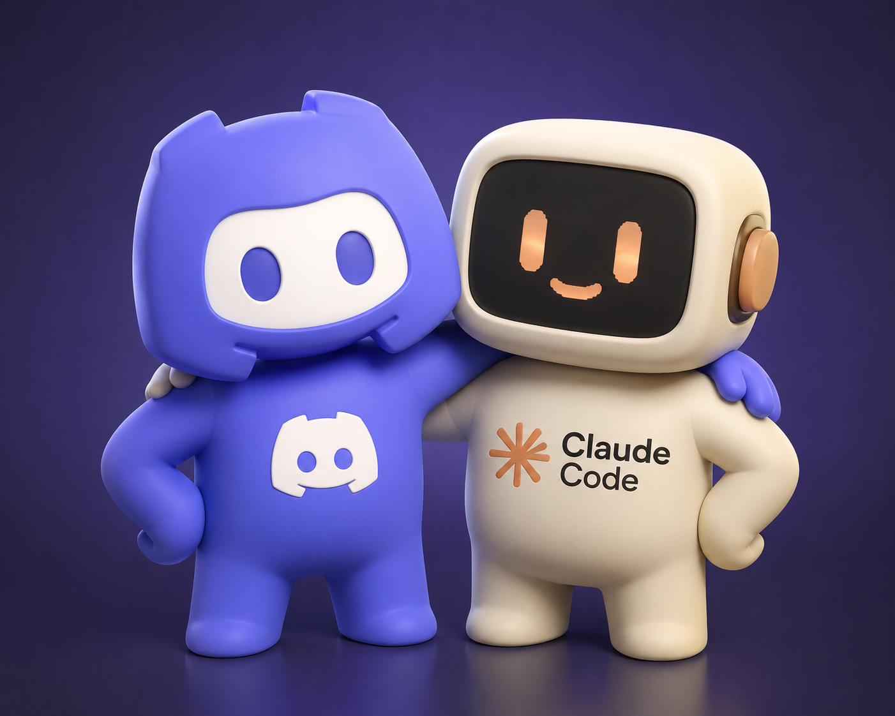
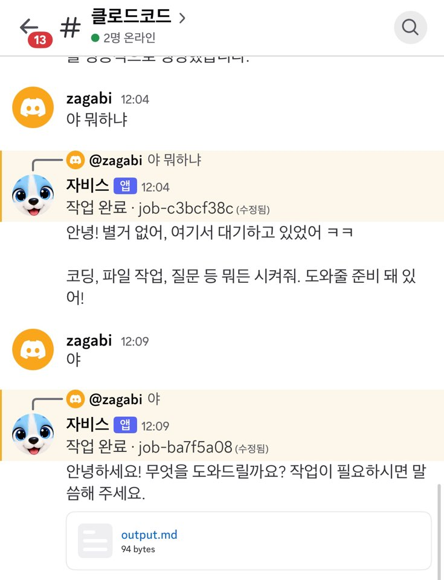

# 디스코드로 부르는 클로드코드, claudecord

[]() 

## 디스코드 앱으로 명령하는 모습


> **PC 앞을 떠나도 멈추지 않는 AI 비서**
> 모바일에서 Discord 메시지 한 통이면, 집에 있는 내 PC의 Claude Code가 깨어나 일을 시작합니다.

[]()
[]()
[](./LICENSE)

---

## ✨ 이런 적 없으셨나요?

카페에서 커피를 마시다가 문득 떠오릅니다.

> *"어제 만들던 숏폼, 미세 조정만 좀 더 하면 되는데..."*

이때 선택지는 두 가지뿐입니다.

1. 노트북을 꺼내 터미널을 띄운다 → **30분 손실**
2. 메모만 하고 PC 앞에 돌아갈 때까지 미룬다 → **절반의 확률로 망각**

이미 집에는 24시간 깨어 있는 PC가 있고, Claude Code도 깔려 있습니다. **부족한 건 단 하나, 모바일에서 그 PC를 연결해서 명령어를 실행하는 비서, claudecord**입니다. 

---

## 🎯 주요 기능

- 📱 **모바일에서 PC 제어**: Discord 메시지로 Claude Code 작업 지시
- 🔒 **화이트리스트 인증**: 등록된 사용자 ID와 채널 ID에서만 동작
- 📦 **작업 격리**: 모든 작업은 `runs/job-xxxx/` 디렉터리에 분리 실행
- 📎 **결과물 자동 첨부**: CLI가 생성한 파일을 Discord로 즉시 전송
- 🛑 **원격 세션 종료**: Discord에서 `종료`를 보내 실행 중인 Claude Code 프로세스와 저장된 대화 세션을 한 번에 정리
- 💸 **추가 비용 0원**: Claude Pro/Max 구독 한도 안에서 동작, API 키 불필요

---

## 🏗️ 작동 방식

```
[모바일/PC Discord]
        │
        ▼ 메시지
[Discord Gateway]  ◄── outbound WebSocket ──┐
                                            │
                                    [내 PC의 claudecord 봇]
                                            │
                                            ▼ subprocess
                                    [Claude Code CLI]
                                            │
                                            ▼
                                    [runs/job-xxxx/]
                                    파일 생성/수정
                                            │
                                            ▼
                                    [Discord 채널에 결과 첨부]
```

봇은 **클라우드가 아닌 내 PC 안에서 돌아갑니다**. Discord Gateway는 봇 쪽에서 outbound WebSocket으로 연결하는 구조라, 별도 호스팅 없이 PC에서 직접 띄울 수 있습니다.

---

## 🚀 빠른 시작

### 사전 요구사항

- Python 3.11 이상
- Claude Code CLI 설치 및 로그인 완료
- Discord 계정

### 1. Discord 봇 만들기

1. [Discord Developer Portal](https://discord.com/developers/applications) 접속
2. **New Application** → 이름 입력 (예: `claudecord`)
3. 좌측 **Bot** 탭 → **Reset Token** → 토큰 복사 후 안전한 곳에 저장
4. **MESSAGE CONTENT INTENT** 토글 **ON**

### 2. 봇 권한 설정

**OAuth2 → URL Generator** 에서 다음을 체크:

**Scopes**
- `bot`
- `applications.commands`

**Bot Permissions**

| 카테고리 | 권한 |
|---|---|
| 일반 | 채널 관리, 채널 보기 |
| 채팅 | 메시지 보내기, 메시지 관리, 링크 임베드, 파일 첨부, 메시지 기록 보기, 빗금 명령어 사용 |

생성된 URL을 브라우저에 붙여넣고 본인 서버에 봇을 초대합니다.

### 3. ID 확보

Discord 설정에서 **개발자 모드**를 켠 뒤:

- **본인 프로필 우클릭 → 사용자 ID 복사**
- **봇 전용 채널 우클릭 → 채널 ID 복사**

### 4. 환경 변수 설정

프로젝트 루트에 `.env` 파일 생성:

```bash
# Discord 봇 토큰 (절대 외부 노출 금지)
DISCORD_BOT_TOKEN=your_bot_token_here

# 봇을 사용할 본인 Discord 계정 ID (쉼표로 여러 개 등록 가능, 부계정 등)
OWNER_DISCORD_ID=123456789012345678

# 봇이 응답할 채널 ID (쉼표로 여러 개 등록 가능)
ALLOWED_CHANNEL_IDS=987654321098765432
```

`.env.example`을 복사해 시작하는 것을 권장합니다 (`cp .env.example .env`).

> ⚠️ **보안 주의**: `.env`는 반드시 `.gitignore`에 추가하세요. 토큰이 유출되면 즉시 **Reset Token** 으로 재발급해야 합니다.

#### 경로 / 프로젝트 태그 (선택)

전부 생략 가능하며, 생략 시 아래 기본값이 적용됩니다.

| 변수 | 기본값 | 설명 |
|---|---|---|
| `PROJECT_ROOT` | `~/projects` | 프로젝트 태그(`@book` 등)가 가리키는 상대 경로의 루트. |
| `PROJECTS_FILE` | 저장소 루트의 `projects.toml` | 프로젝트 태그 정의 TOML 경로. 파일이 없으면 프로젝트 태그 없이 정상 동작합니다. `projects.example.toml`을 `projects.toml`로 복사해 자신의 프로젝트로 채우세요. |
| `RUNS_DIR` | `~/.claudecord/runs` | 잡 디렉터리(`job-xxxx/`) 위치. 세션 저장소(`~/.claudecord/sessions.json`)와 같은 트리 아래 두는 것을 권장합니다. |
| `RUNS_RETENTION_DAYS` | `30` | 이 일수보다 오래된 잡 디렉터리를 정리합니다. `0`이면 정리를 끕니다. |
| `CLAUDE_BIN` | (PATH에서 탐색) | `claude` 실행 파일 경로. PATH에서 찾지 못할 때, 특히 launchd/작업 스케줄러로 상시 구동해 PATH가 축소되는 환경에서 지정하세요. |

#### 성능/동작 튜닝 (선택)

전부 생략 가능하며, 생략 시 아래 기본값이 적용됩니다.

| 변수 | 기본값 | 설명 |
|---|---|---|
| `CLAUDE_MODEL` | `sonnet` | Claude CLI에 넘길 모델. 디스코드 요청 대부분은 sonnet으로 충분하고 가장 빠릅니다. 복잡한 작업 위주라면 `opus`로 올리세요. |
| `CLAUDE_STREAM_LIMIT_BYTES` | `8388608` (8MiB) | stream-json 한 줄의 최대 바이트. 아주 큰 파일을 Write할 때 스트림이 끊기면 늘리세요. |
| `WORKING_GIF` | 꺼짐 | `1`/`true`로 켜면 "작업중" GIF를 첨부합니다. 켜면 첫 응답이 GIF 업로드 시간만큼 늦어집니다. |
| `SESSION_TTL_SECONDS` | `3600` | 채널별 대화 세션 유지 시간(초). 길수록 대화 문맥이 누적되어 턴당 응답이 조금씩 느려집니다. 짧게 잡으면 대화가 자주 초기화되는 대신 빨라집니다. |

##### 웜 프로세스

메시지마다 `claude` 프로세스를 새로 띄우면 아무 일도 하지 않는 요청조차 기동에만 1.4~1.6초가 듭니다. 웜 프로세스는 한 프로세스를 여러 턴에 걸쳐 재사용해 두 번째 메시지부터 이 비용을 없앱니다.

| 변수 | 기본값 | 설명 |
|---|---|---|
| `WARM_CLAUDE` | `1` (켜짐) | `0`이면 매번 새로 띄우는 기존 방식. 웜 경로는 어떤 실패에서든 자동으로 기존 방식으로 폴백하므로, 이 스위치는 문제를 격리할 때만 쓰면 됩니다. |
| `WARM_CLAUDE_IDLE_TTL_SECONDS` | `300` | 재사용 대기 중인 프로세스를 정리하기까지의 유휴 시간(초). |
| `WARM_CLAUDE_MAX_PROCESSES` | `2` | 동시에 살려둘 유휴 프로세스 상한. 초과하면 오래된 것부터 정리합니다. `0`이면 재사용하지 않습니다. |

디스코드에서 `종료`를 보내면 실행 중인 프로세스와 함께 재사용 대기 중인 프로세스도 전부 정리됩니다.

##### 잡 상한

| 변수 | 기본값 | 설명 |
|---|---|---|
| `JOB_TIMEOUT_SECONDS` | `600` | 잡 하나의 최대 실행 시간(초). 초과하면 프로세스를 정리하고 그때까지의 부분 결과를 보냅니다. `0` 이하면 타임아웃 없음. |
| `MAX_CONCURRENT_JOBS` | `2` | 동시에 실행할 잡 수 상한. 초과분은 `대기 중 (앞에 N건)`으로 안내하고 순서를 기다립니다. |

상한이 없으면 메시지를 연달아 보낼 때 프로세스가 그만큼 동시에 떠서 서로를 느리게 만듭니다.

##### 출력·진단

| 변수 | 기본값 | 설명 |
|---|---|---|
| `OUTPUT_INLINE_MAX_CHUNKS` | `3` | 답변이 이 조각 수를 넘으면 여러 건으로 쪼개 보내는 대신 `response.md` 첨부 1건으로 전환합니다. 채널당 5건/5초 제한에 걸려 마지막 조각이 늦게 도착하는 걸 막습니다. |
| `LOG_LEVEL` | `INFO` | 로그 레벨(`DEBUG`/`INFO`/`WARNING`/`ERROR`). 상시 구동 중 문제를 추적할 때 `DEBUG`로 낮추세요. |
| `DEBUG_TIMING` | 꺼짐 | `1`/`true`면 최종 응답 끝에 구간별 소요 시간을 한 줄 덧붙입니다. 구간 기록 자체는 항상 `<job_dir>/timings.json`에 남습니다. |


> 응답이 느리게 느껴지면 먼저 `DEBUG_TIMING=1`로 어느 구간이 오래 걸리는지 확인하세요. 그다음 `CLAUDE_MODEL`을 조정하는 순서가 빠릅니다.

### 5. 설치 및 실행

**macOS / Linux**

```bash
pip install -e .          # 또는 scripts/setup.sh (.venv를 만들어 설치)
python -m src.main        # 또는 scripts/run_bot.sh (.venv 파이썬으로 실행)
```

**Windows (PowerShell)**

```powershell
scripts\setup.ps1         # .venv 생성 후 pip install -e .
scripts\run_bot.ps1       # .venv 파이썬으로 실행
```

의존성의 단일 진실 원천은 `pyproject.toml`이고, 진입점은 `src/main.py`의 `main()`입니다. `scripts/run_bot.sh`·`run_bot.ps1`은 `scripts/setup`으로 만든 `.venv`가 있는지 먼저 확인하고, 없으면 안내 메시지와 함께 중단합니다.

봇이 온라인 상태로 바뀌면 준비 완료입니다.

#### 상시 구동 (선택)

터미널을 켜 두지 않고 PC 부팅/로그인 시 자동으로 봇을 띄우려면:

| 플랫폼 | 등록 | 해제 |
|---|---|---|
| macOS | `scripts/launchd_load.sh` — LaunchAgent 등록 (`RunAtLoad` + `KeepAlive`로 상시 구동, 죽으면 자동 재시작) | `launchctl unload ~/Library/LaunchAgents/com.discord-claude-assistant.plist` |
| Windows | `scripts\register_scheduled_task.ps1` — 로그온 시 작업 스케줄러로 기동 (실패 시 최대 3회 재시작) | `scripts\unregister_scheduled_task.ps1` |

두 스크립트 모두 `.venv`의 파이썬을 직접 지정해 실행하므로 `scripts/setup`을 먼저 실행해 둬야 합니다. 데몬으로 띄우면 PATH가 로그인 셸보다 축소되어 `claude` CLI를 못 찾을 수 있습니다 — 이럴 때 `.env`에 `CLAUDE_BIN`을 절대경로로 지정하세요. `scripts/check_claude.sh` / `check_claude.ps1`으로 봇이 실제로 쓸 `claude` 바이너리(`.env`의 `CLAUDE_BIN` → PATH 순으로 탐색)에 정상적으로 연결되는지 미리 진단할 수 있습니다.

---

## 🧪 테스트

[uv](https://docs.astral.sh/uv/)가 있다면 별도 설치 없이 바로 실행할 수 있습니다:

```bash
uv run pytest -q
uv run ruff check .
```

uv 없이 `pip install -e .`(또는 `scripts/setup.sh`)로 이미 설치했다면, 가상환경에 `pytest`·`ruff`만 추가로 설치해 돌립니다:

```bash
.venv/bin/pip install pytest ruff
.venv/bin/pytest -q
.venv/bin/ruff check .
```

CI(`.github/workflows/ci.yml`)도 동일하게 `uv run pytest -q`를 macOS/Linux, Python 3.11/3.13에서 돌립니다 — Windows는 스크립트는 제공하지만 아직 CI에서 매번 통과가 확인되지는 않았습니다.

---

## 🔐 보안 모델 — 반드시 읽어주세요

claudecord는 **Discord 메시지 한 통으로 내 PC에서 Claude Code CLI를 실행하는** 도구입니다.
이 봇에 메시지를 보낼 수 있는 사람은 **내 계정 권한으로 무엇이든 할 수 있습니다.**

### 실제 방어선은 하나입니다

| 계층 | 무엇을 막나 | 실효성 |
|---|---|---|
| `OWNER_DISCORD_ID` / `ALLOWED_CHANNEL_IDS` 화이트리스트 | 다른 사람의 명령 | ✅ **유일한 실질 방어선** |
| `--disallowedTools` (`rm`, `sudo`, `curl` 등) | 실수로 나간 파괴적 명령 | ⚠️ 사고 방지용에 한함 |
| `--tools` (도구 28개 → 9개) | 봇이 안 쓰는 도구 전부 | ⚠️ 표면 축소이지 격리는 아님 |
| 프롬프트 규칙("두 디렉터리 밖에는 쓰지 않는다") | — | ❌ 강제력 없음 |
| OS 수준 격리 | — | ❌ 없음 |

### 보장되는 것과 보장되지 않는 것

claudecord는 `--permission-mode bypassPermissions`로 CLI를 실행합니다.
Claude Code 2.1.251에서 직접 실험해 확인한 동작은 다음과 같습니다.

**✅ 실제로 막히는 것**

- `--disallowedTools`는 이 모드에서도 **강제됩니다.** `rm foo`, `curl --version`,
  `echo hi && rm foo` 는 모두 차단되고 `permission_denied` 이벤트가 발생합니다.
  `&&`로 이어붙인 뒤쪽 서브커맨드까지 검사합니다.
- 그래서 **실수로 나가는 `rm`은 실제로 막아줍니다.** 이 차단 목록은 장식이 아닙니다.

**❌ 막히지 않는 것 (중요)**

- **차단 목록은 명령 문자열 앞부분 매칭입니다.** `rm foo`는 막히지만
  `/bin/rm foo` 나 `python3 -c "import os; os.remove('foo')"` 는
  **차단되지 않고 그대로 실행됩니다.** 실제로 파일이 삭제되는 것을 확인했습니다.
  즉 이것은 *사고 방지용 가드레일*이지, 의도적인 명령을 막는 보안 경계가 아닙니다.
- **도구를 줄여도 `Bash`가 남으면 경계가 아닙니다.** `--tools`로 세션 도구를 28개에서
  9개(`Read`, `Edit`, `Write`, `NotebookEdit`, `Glob`, `Grep`, `Bash`, `WebFetch`,
  `WebSearch`)로 줄였고, 목록 밖의 도구는 모델에게 아예 보이지 않습니다.
  하지만 `Bash`가 있는 한 임의 실행은 그대로이므로, 이것은 *표면 축소*이지 격리가 아닙니다.
  (이전에는 `--allowedTools`를 넘겼는데, 그 인자는 "묻지 말고 승인하라"는 사전 승인
  목록이라 모든 것을 이미 승인하는 `bypassPermissions`에서는 아무 효과가 없었습니다.)
- **파일시스템 경계가 없습니다.** 작업 디렉터리 밖, `--add-dir`로 지정한 경로 밖의
  임의 절대경로에 읽기·쓰기가 가능합니다. 거부 이벤트조차 발생하지 않습니다.
  기본 권한 모드에는 이 쓰기 샌드박스가 존재하지만, `bypassPermissions`가 그것을 해제합니다.
- **네트워크 송신을 막지 못합니다.** `curl`/`wget`은 차단되지만 `WebFetch`는 의도적으로
  남겨두었습니다("이 링크 요약해줘"가 정상적인 요청이므로). 설령 `WebFetch`를 빼더라도
  `Bash`로 `python3 -c "import urllib.request"` 를 실행하면 그만이므로,
  파일을 읽어 외부로 보내는 경로는 어느 쪽이든 열려 있습니다.

### 정리하면

> **Discord 계정이 탈취되거나 `ALLOWED_CHANNEL_IDS`를 잘못 설정하면,
> 그 즉시 내 PC에 대한 원격 코드 실행 권한을 넘겨준 것과 같습니다.**
> 봇이 실행 중인 사용자 계정이 접근할 수 있는 모든 파일 — SSH 키, 브라우저 프로필,
> 클라우드 자격증명을 포함해 — 이 열려 있다고 가정하세요.

또한 **신뢰할 수 없는 저장소**를 봇의 작업 대상으로 삼지 마세요.
그 저장소의 README·이슈·소스 주석에 심어둔 지시문이 모델 컨텍스트로 들어가고
(간접 프롬프트 인젝션), `WebFetch`를 통해 읽은 내용이 외부로 나갈 수 있습니다.
이 경로는 지시를 넣는 주체가 Discord 사용자가 아니기 때문에
소유자 화이트리스트로 막을 수 없습니다.

### 권장 운용 수칙

1. **Discord 계정에 2단계 인증(2FA)을 켜세요.** 사실상 유일한 자물쇠입니다.
2. **`ALLOWED_CHANNEL_IDS`를 반드시 설정하세요.** 다만 이 값을 채워도
   **소유자 계정의 DM은 채널 검사를 건너뛰고 언제나 허용됩니다.**
   채널을 좁혔다고 해서 경로가 하나로 줄어드는 것이 아닙니다.
3. **전용 사용자 계정이나 컨테이너에서 실행하세요.** 개인 홈 디렉터리·SSH 키·
   클라우드 자격증명에 접근할 수 없는 별도 OS 계정에서 봇을 띄우는 것이
   현재로서 **피해 범위를 실제로 한정하는 유일한 수단**입니다.
4. **되돌릴 수 없는 대상은 작업 범위에서 빼세요.** 백업이 있는 저장소로 한정하세요.
5. `.env`는 반드시 `.gitignore`에 넣고, 토큰이 유출되면 즉시 **Reset Token** 하세요.

## 💬 사용 예시

Discord 채널에 그냥 자연어로 말하면 됩니다.

```
나: 안녕?
봇: 안녕하세요! 무엇을 도와드릴까요?

나: 바탕화면 develop 폴더 안에 ap4 폴더 만들어줘
봇: ✅ 작업 완료. /Users/me/Desktop/develop/ap4 디렉터리를 생성했습니다.

나: 어제 만든 숏폼 영상 자막 위치를 화면 하단 20%로 조정해줘
봇: 🔄 runs/job-a1b2c3 작업 시작...
봇: ✅ 완료. 수정된 파일을 첨부합니다. [output.mp4 📎]

나: 종료
봇: Claude 세션 종료 완료.
```

`종료`는 봇을 끄지 않고, claudecord가 실행 중인 Claude Code CLI 프로세스와 저장된 이어하기 세션을 모두 정리합니다. 다음 메시지는 새 Claude 대화로 시작됩니다.

---
